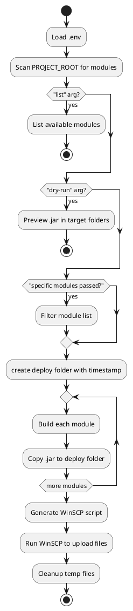

# 📦 Batch Deployment Tool for Multi-Module Maven Projects (Windows)

This tool automates the build and deployment of multiple Maven-based microservices.

---

## ✅ Prerequisites

1. **Windows OS** with CMD support
2. **Java + Maven installed** and available in PATH
3. **WinSCP** installed (with GUI or CLI version)
4. Folder structure:

```plaintext
C:\deploy-tools\
├── deploy.bat         <-- This batch file
├── .env               <-- Environment configuration
├── .deployignore      <-- Folder names to exclude
├── history\           <-- Where jars will be copied with timestamp folders
└── [project-root]\    <-- Your microservices folder (defined in .env)
```

---

## 📁 .env file example

```ini
PROJECT_ROOT=C:\projects\project1
HISTORY_DIR=C:\deploy-tools\history

SERVER_USER=deploy
SERVER_PASS=yourpassword
SERVER_IP=192.168.1.100
SERVER_DEST_PATH=/opt/deploy

WINSCP_PATH=C:\Program Files (x86)\WinSCP\WinSCP.exe
WINSCP_PROTOCOL=sftp
```

---

## 🚀 Usage (from CMD)

### 🔹 1. Deploy All Modules

```cmd
deploy.bat
```

➡ Builds all subfolders (excluding those listed in `.deployignore`), copies `.jar` files to a timestamped folder, and uploads to server.

### 🔹 2. Deploy Selected Modules Only

```cmd
deploy.bat service-a service-b
```

➡ Builds and deploys only specified modules.

### 🔹 3. List Available Modules

```cmd
deploy.bat list
```

➡ Lists module folders detected in `PROJECT_ROOT`, excluding `.deployignore`

### 🔹 4. Dry Run (Preview)

```cmd
deploy.bat dry-run
```

➡ Shows which modules would be built and lists their `.jar` outputs if available.

---

## ⚙️ Internal Logic

- Generates timestamp using PowerShell
- Builds each module via `mvn clean install -DskipTests`
- Collects `.jar` from each module’s `target` folder
- Copies `.jar` files to `%HISTORY_DIR%\deploy-<timestamp>`
- Uploads to server via **WinSCP script mode** over **SFTP**

### 📊 Workflow Diagram (PlantUML)



🔗 View and edit this diagram online: [plantuml.live](https://plantuml.live)

---

## 🧹 Notes

- Ensure your server accepts **SFTP** connections
- `.deployignore` supports folder names only (e.g., `.git`, `deploy`, `history`)
- Avoid spaces in folder names unless you quote properly in `.env`

---

## 📞 Need Help?

If you need to adapt this to SSH key-based auth, auto-versioning, GitHub Actions, or multi-server environments — feel free to ask!

